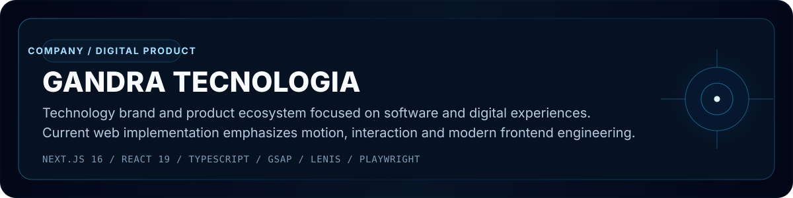
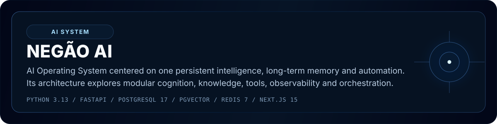
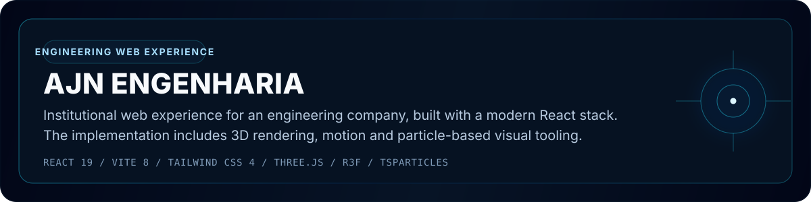
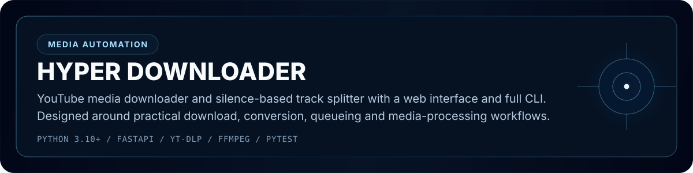
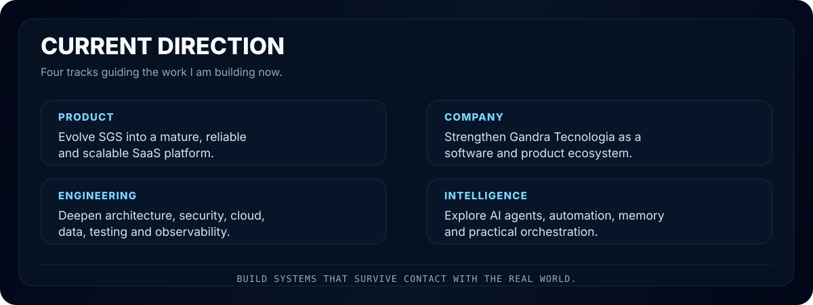

 

&nbsp;

&nbsp;

## 01 / PROFILE

I am **Wanderson Gandra**, building software at the intersection of **engineering, operations, security and intelligent systems**.

My professional background in **Occupational Safety** shapes a practical approach to software: design for real users, real controls, real data and real operational constraints. I am especially interested in systems that improve **control, visibility, security, efficiency, intelligence and scale**.

`CONTROL` &nbsp; `VISIBILITY` &nbsp; `SECURITY` &nbsp; `EFFICIENCY` &nbsp; `INTELLIGENCE` &nbsp; `SCALE`

## 02 / CORE PRODUCT

**SGS — Sistema de Gestão de Segurança** is a B2B multi-tenant SaaS platform for **Saúde e Segurança do Trabalho (SST)**, designed around governed documents, inspections, permissions, indicators, auditability and operational workflows.

**Production:** https://app.sgsseguranca.com.br  
**Repository:** https://github.com/wandersongandra/sgsseguranca

### Core technology

## 03 / SELECTED WORK

 

 

 

## 04 / ENGINEERING STACK

### Application

### Data

### Infrastructure

## 05 / SYSTEM THINKING

<table>
<tr>
<td width="25%" valign="top">

**SOFTWARE**

Architecture  
APIs  
Modularity  
Testing  
Performance  
Scalability

</td>
<td width="25%" valign="top">

**SECURITY**

Authentication  
Authorization  
RBAC  
Tenant isolation  
Auditability  
Secure APIs

</td>
<td width="25%" valign="top">

**INTELLIGENCE**

LLMs  
AI agents  
RAG  
Tool calling  
Memory  
Orchestration

</td>
<td width="25%" valign="top">

**INFRASTRUCTURE**

Containers  
CI/CD  
Workers  
Caching  
Observability  
Cloud

</td>
</tr>
</table>

## 06 / CURRENT DIRECTION

## 07 / GITHUB SIGNAL

  

### BUILD SYSTEMS THAT MATTER.

Software Engineering &nbsp; / &nbsp; SaaS &nbsp; / &nbsp; AI &nbsp; / &nbsp; Automation &nbsp; / &nbsp; Cloud

 

[SGS Production](https://app.sgsseguranca.com.br)
&nbsp;&nbsp;•&nbsp;&nbsp;
[GitHub](https://github.com/wandersongandra)
&nbsp;&nbsp;•&nbsp;&nbsp;
[SGS Repository](https://github.com/wandersongandra/sgsseguranca)

  

