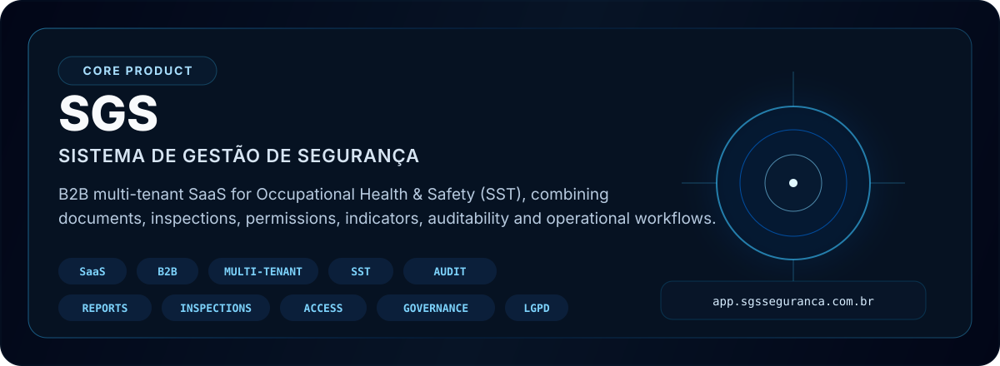
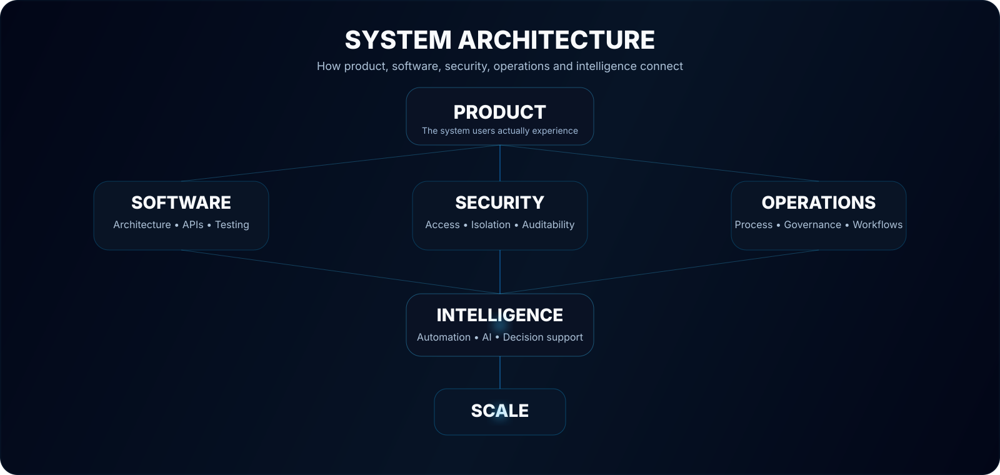

<div align="center">



<br>

<a href="https://app.sgsseguranca.com.br">
  
</a>
&nbsp;
<a href="https://github.com/wandersongandra/sgsseguranca">
  
</a>
&nbsp;
<a href="https://github.com/wandersongandra">
  
</a>

</div>


## PROFILE

I am **Wanderson Gandra**, building technology at the intersection of **software engineering, operations, security and intelligent systems**.

My background in Workplace Safety gives me a practical view of how software behaves in real companies, real workflows and real operational environments.  
That perspective shapes how I think about products: not just code, but systems that improve control, visibility, security, efficiency and scale.

<div align="center">

`CONTROL` • `VISIBILITY` • `SECURITY` • `EFFICIENCY` • `INTELLIGENCE` • `SCALE`

</div>


## MAIN SYSTEM



### OFFICIAL LINKS

- **Production:** https://app.sgsseguranca.com.br  
- **Repository:** https://github.com/wandersongandra/sgsseguranca  

### CORE TECHNOLOGY

<div align="center">


</div>


## PROJECT NETWORK

<table>
<tr>
<td width="50%" valign="top">

### SGS

Multi-tenant B2B SaaS for structured Workplace Safety operations.

`SAAS` `SST` `MULTI-TENANT` `SECURITY`

[View repository](https://github.com/wandersongandra/sgsseguranca)

</td>
<td width="50%" valign="top">

### Gandra Tecnologia

Technology company and product ecosystem focused on software, digital systems and innovation.

`SOFTWARE` `PRODUCT` `TECHNOLOGY`

[View repository](https://github.com/wandersongandra/gandra-tech)

</td>
</tr>

<tr>
<td width="50%" valign="top">

### Negão AI

Personal intelligent-agent ecosystem exploring memory, orchestration, tools and automation.

`AI` `AGENTS` `MEMORY` `AUTOMATION`

[View repository](https://github.com/wandersongandra/Neg-o-IA)

</td>
<td width="50%" valign="top">

### AJN Engenharia

Modern institutional experience for engineering and technical services.

`WEB` `ENGINEERING` `EXPERIENCE`

[View repository](https://github.com/wandersongandra/ajn-engenharia-site)

</td>
</tr>

<tr>
<td width="50%" valign="top">

### Hyper Downloader

Media download and processing application focused on automation and practical workflows.

`PYTHON` `FFMPEG` `YT-DLP`

[View repository](https://github.com/wandersongandra/baixador_musica)

</td>
<td width="50%" valign="top">

### Next System

New work focused on SaaS, AI, automation, security and cloud systems.

`BUILDING`

</td>
</tr>
</table>


## ENGINEERING STACK

### Application

<div align="center">


</div>

### Data

<div align="center">


</div>

### Infrastructure

<div align="center">


</div>


## SYSTEM THINKING



My main areas of study and development:

<table>
<tr>
<td width="25%" valign="top">

### Software

Architecture  
APIs  
Modularity  
Testing  
Performance  
Scalability  

</td>
<td width="25%" valign="top">

### Security

Authentication  
Authorization  
RBAC  
Tenant isolation  
Auditability  
Secure APIs  

</td>
<td width="25%" valign="top">

### Intelligence

LLMs  
AI Agents  
RAG  
Tool Calling  
Memory  
Orchestration  

</td>
<td width="25%" valign="top">

### Infrastructure

Containers  
CI/CD  
Workers  
Caching  
Observability  
Cloud  

</td>
</tr>
</table>


## DEVELOPMENT SIGNAL

<div align="center">


<br><br>


<br>


</div>


## CURRENT MISSION

```yaml
primary:
  - evolve SGS into a mature SaaS platform
  - build Gandra Tecnologia as a software ecosystem

engineering:
  - architecture
  - application security
  - cloud infrastructure
  - databases
  - testing
  - observability

intelligence:
  - AI agents
  - automation
  - orchestration
  - practical AI systems

principle:
  "Build systems that survive contact with the real world."
```


